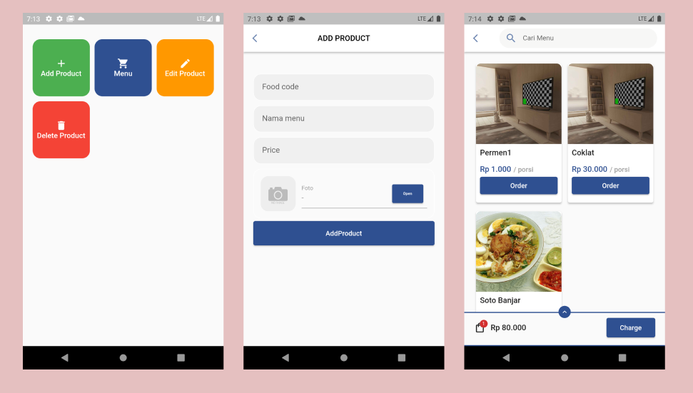

# Food App (Bloc State Management) //Api Consume


## Link Aplikasi
https://drive.google.com/file/d/11HHpXTbwm6ZYkFHfJStKy4L0vQDUfjjh/view?usp=share_link

## Getting Started

Pastikan sudah menginstall Git dan Flutter pada environment kalian.

### Prerequisites

- Flutter
  ```sh
  https://docs.flutter.dev/get-started/install
  ```
- Git
  ```sh
  https://git-scm.com/downloads
  ```
  
### Installation

1. Clone the repo
   ```sh
   git clone https://github.com/fadillahnurfaq/FadillahNurFaqih_Mobileapps
   ```
2. Install the dependencies
   ```sh
   flutter pub get
   ```
3. Run
   ```sh
   Run Without Debugging On Vs Code
   ```

## Detail Aplikasi



## Dependencies
Berikut ini merupakan dependencies yang digunakan dalam project ini:

### State Mangement
- flutter_bloc: ^8.1.2
- equatable: ^2.0.5
- rxdart: ^0.27.7
- dartz: ^0.10.1

### UI
- flutter_rating_bar: ^4.0.1
- font_awesome_flutter: ^10.4.0
- cupertino_icons: ^1.0.2
- cached_network_image: ^3.2.3

### HTTP
- dio: ^5.1.1

### ETC
- flutter_dotenv: ^5.0.2
- hive: ^2.2.3
- currency_text_input_formatter: ^2.1.9
- file_picker: ^5.2.7
- image_picker: ^0.8.7+1
- path_provider: ^2.0.14
- intl: ^0.18.0
